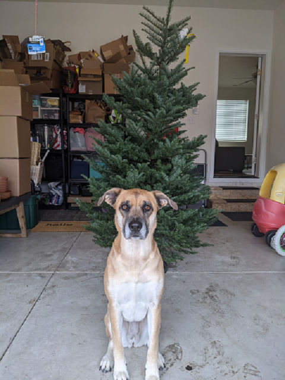

# Packet Injection Experimentation - 2/10/21

## Setup

Used the same setup mentioned in `injection_test-1-30-21.md`

Instead of using TCPDump and Russel Seniors script we will be using the DxWiFi
prototype as of commit a7e4e3 built in release configuration. As of this commit
there is no FEC or Packet erasure strategies in place

## Process 

A simple test to see if everythings working is to send over the README.
On both the raspberry pi and beaglebone black do the following:

```bash
git clone https://github.com/AlexanderJDupree/dxwifi-prototype.git
cd dxwifi-prototype
cmake -S . -B build -DCMAKE_BUILD_TYPE=Release
cmake --build build
sudo ./startMonitor.sh 
```

On the receiver (Raspberry Pi)
```
sudo ./bin/rx output.md
```

On the transmitter (BBB)
``` 
sudo ./bin/tx README.md
```

The results should be that the README was copied from the BBB to the Raspberry Pi in the file `output.md`

## Tests

Attemped to transfer a variety of files and see what settings have the greatest impact on 
quality. All tests were conducted over 802.11b DSSS @ 1mbps with about ~6 distance between
transmitter and receiver. 

### Small Uncompressed image

Attempted to send an image of my dog, Daisy, via DxWiFi. The image is 480x640 Bitmap with 24 bit 
pixel format. Approximately 921,654 bytes.


Here's the original image:



First test with default settings. 

```
oresat@live:~/dxwifi-prototype$ time sudo ./bin/Release/tx ~/daisy.bmp -vvvvv
[ INFO ] : DxWifi Transmitter Settings
        Device:        mon0
        Block Size:    512
        Data Rate:     1Mbps
        RTAP flags:    0x10
        RTAP Tx flags: 0x8

[ INFO ] : Starting transmission...
[ INFO ] : Transmission Stats
        Total Bytes Read:    921654
        Total Bytes Sent:    993694
        Total Frames Sent:   1801

[ INFO ] : DxWifi Transmitter closed

real    0m8.441s
user    0m0.106s
sys     0m0.445s
```

```
pi@raspberrypi:~/dxwifi-protoype $ sudo ./bin/rx -vvvvv daisy-rx1.bmp
[ INFO ] : DxWifi Receiver Settings
        Device:                   mon0
        Filter:                   wlan addr2 aa:aa:aa:aa:aa:aa
        Optimize:                 1
        Snapshot Length:          65535
        Packet Buffer Timeout:    20ms
        Datalink Type:            802.11 plus radiotap header

[ INFO ] : Starting packet capture...
^C[ INFO ] : DxWiFi Receiver capture ended
[ INFO ] : Receiver Capture Stats
        Packets Received: 1740
        Packets Dropped (Kernel): 0
        Packets Dropped (NIC): 0
[ INFO ] : DxWifi Receiver closed
```

`Data Overhead: ~7.25%, Loss Rate: 3.39%`

Which results in this jumble


Adding a larger block size does help tremendously, but there is lost data.

```
oresat@live:~/dxwifi-prototype$ time sudo ./bin/Release/tx ~/daisy.bmp -vvvvv -b 1400
[ INFO ] : DxWifi Transmitter Settings
        Device:        mon0
        Block Size:    1400
        Data Rate:     1Mbps
        RTAP flags:    0x10
        RTAP Tx flags: 0x8

[ INFO ] : Starting transmission...
[ INFO ] : Transmission Stats
        Total Bytes Read:    921654
        Total Bytes Sent:    948014
        Total Frames Sent:   659

[ INFO ] : DxWifi Transmitter closed

real    0m7.604s
user    0m0.066s
sys     0m0.267s
```

```
pi@raspberrypi:~/dxwifi-protoype $ sudo ./bin/rx -vvvvv daisy-rx2.bmp
[ INFO ] : DxWifi Receiver Settings
        Device:                   mon0
        Filter:                   wlan addr2 aa:aa:aa:aa:aa:aa
        Optimize:                 1
        Snapshot Length:          65535
        Packet Buffer Timeout:    20ms
        Datalink Type:            802.11 plus radiotap header

[ INFO ] : Starting packet capture...
^C[ INFO ] : DxWiFi Receiver capture ended
[ INFO ] : Receiver Capture Stats
        Packets Received: 624
        Packets Dropped (Kernel): 0
        Packets Dropped (NIC): 0
[ INFO ] : DxWifi Receiver closed
```
`Data Overhead: ~2.8%, Loss Rate: 5.3%`


Adding the `ordered` flag seems to help a lot with coherance since we're not trying to 
reorder the data at the receiving end. 

```
oresat@live:~/dxwifi-prototype$ time sudo ./bin/Release/tx ~/daisy.bmp -vvvvv -b 1400 --ordered
[ INFO ] : DxWifi Transmitter Settings
        Device:        mon0
        Block Size:    1400
        Data Rate:     1Mbps
        RTAP flags:    0x10
        RTAP Tx flags: 0x0

[ INFO ] : Starting transmission...
[ INFO ] : Transmission Stats
        Total Bytes Read:    921654
        Total Bytes Sent:    948014
        Total Frames Sent:   659

[ INFO ] : DxWifi Transmitter closed

real    0m7.601s
user    0m0.068s
sys     0m0.264s
```

```
pi@raspberrypi:~/dxwifi-protoype $ sudo ./bin/rx -vvvvv daisy-rx3.bmp
[ INFO ] : DxWifi Receiver Settings
        Device:                   mon0
        Filter:                   wlan addr2 aa:aa:aa:aa:aa:aa
        Optimize:                 1
        Snapshot Length:          65535
        Packet Buffer Timeout:    20ms
        Datalink Type:            802.11 plus radiotap header

[ INFO ] : Starting packet capture...
^C[ INFO ] : DxWiFi Receiver capture ended
[ INFO ] : Receiver Capture Stats
        Packets Received: 639
        Packets Dropped (Kernel): 0
        Packets Dropped (NIC): 0
[ INFO ] : DxWifi Receiver closed
```

`Data Overhead: ~2.8%, Loss Rate: 3.0%`


Repeating the tests yielded similar results. Except the `ordering` flag sometimes 
seemed to help and sometimes did not. We should see if adding a delay between 
packet transmissions help at all. 
